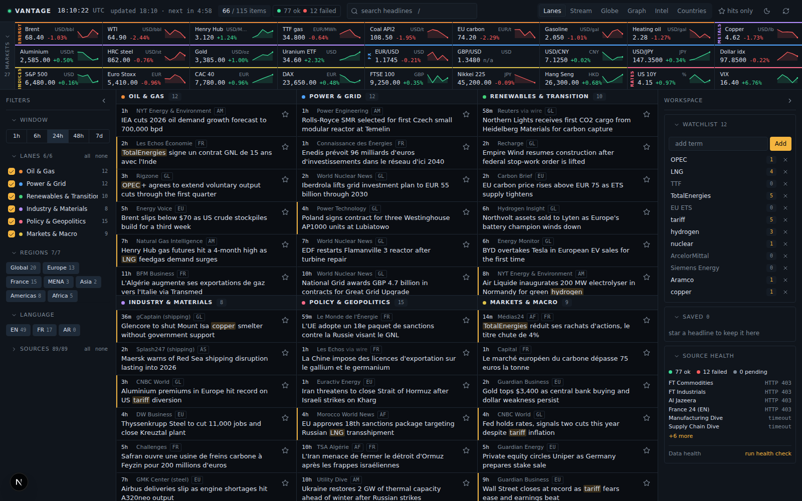
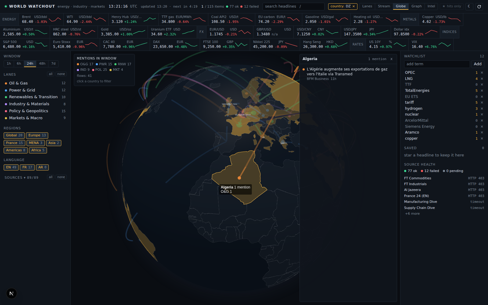
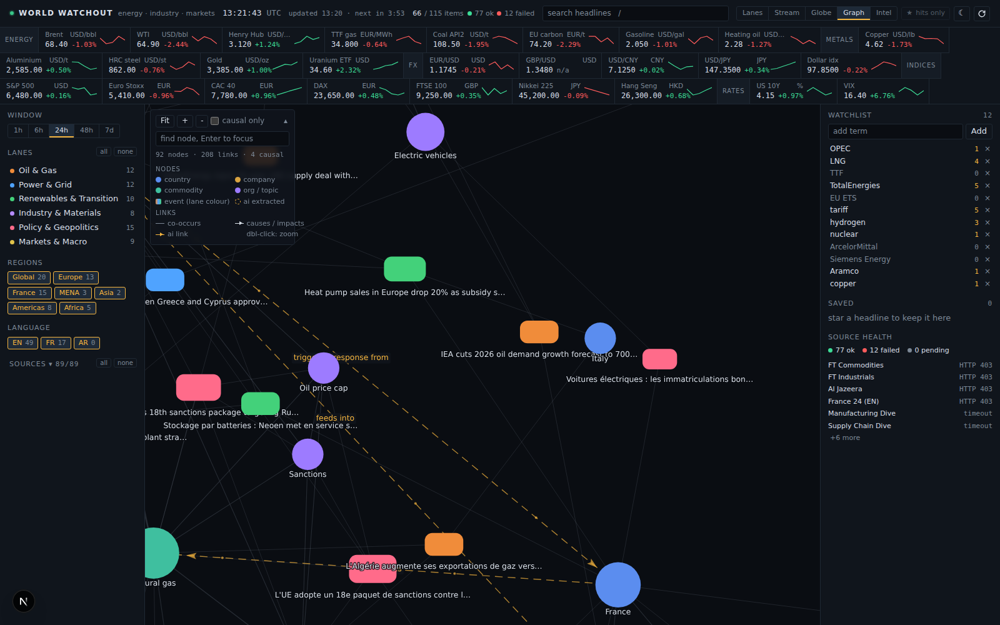
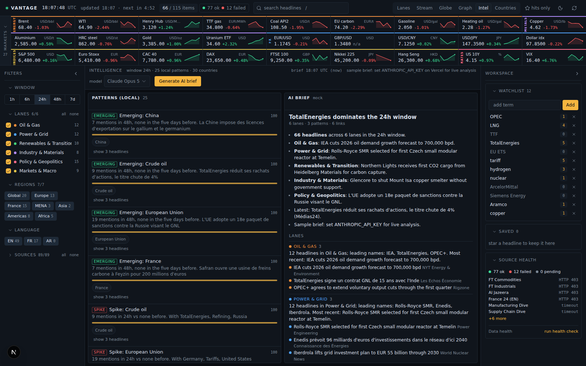
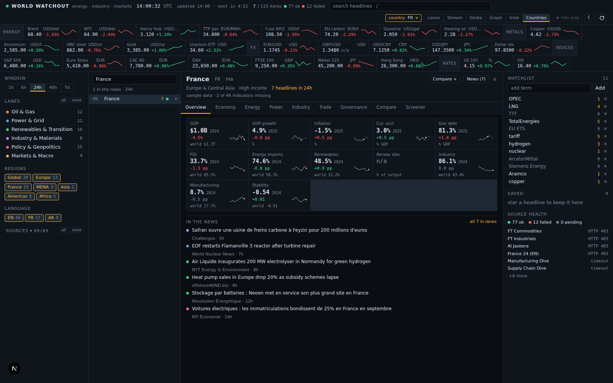
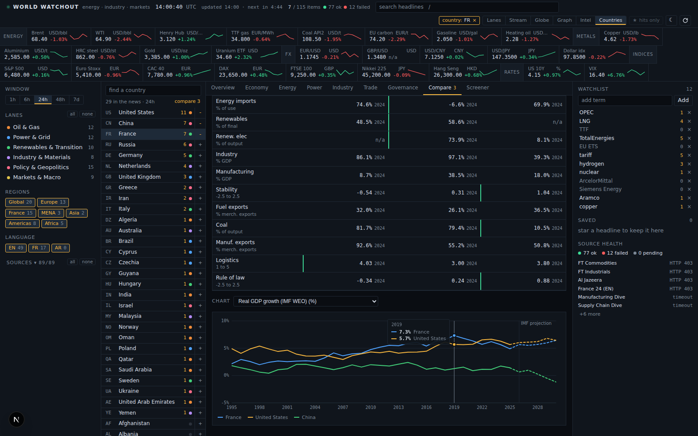

# World Watchout

A control center for world news, built for market research in energy and industry. It pulls about 90 live RSS wires, sorts every headline into one of six lanes, runs a market ticker across the top, highlights the terms you are watching and keeps the items you star. On top of that it tags every headline with countries, companies, commodities, organisations and topics, and turns those tags into a globe, a force graph and a set of explainable patterns, all computed in the browser. A Countries view adds a data card per country (World Bank and IMF WEO), a compare table and a screener. No accounts, no database, no API key required: a Next.js app that fetches public feeds and public quote endpoints and stores your preferences in the browser. One optional key (`ANTHROPIC_API_KEY`) enables the AI brief.













## Features

- **Six lanes**: Oil & Gas, Power & Grid, Renewables & Transition, Industry & Materials, Policy & Geopolitics, Markets & Macro. Lanes are assigned by keyword rules (English and French), with secondary lanes shown when you expand a row. Lanes view or a single Stream view.
- **Globe**: 3D globe (globe.gl, three.js, world-atlas country shapes bundled, no external tiles) shaded by mention intensity per country, lane-coloured points, animated flow arcs between countries named together in a headline (companies count as their home country). Click a country to filter every other view; a headline sheet lists that country's items.
- **Graph**: zoomable force graph (react-force-graph-2d) of countries, companies, commodities, organisations, topics and event nodes (the headlines that bind them). Co-occurrence links plus typed causal links (causes, impacts, triggers, responds, supplies) drawn with arrows and particles. Labels reveal progressively as you zoom; focus a node to see its neighbourhood, its headlines and its links. A "causal only" toggle and a node finder.
- **Intel**: explainable local patterns (spikes against a 6-day baseline, emerging entities, co-occurrence clusters, co-movement) computed in the browser in about 50 ms on every refresh and filter change, each one citing its headlines, plus an AI brief on demand (see below).
- **Countries**: a card per country with 46 indicators across Economy, Energy, Power, Industry, Trade and Governance, pulled keyless from the World Bank API and the IMF WEO datamapper: 30 years of history plus IMF projections to 2030. Overview tab with twelve KPI tiles (latest value, year, sparkline with dashed forecast, delta coloured by the indicator's favourable direction, world reference), one tab per group with a full table (1y and 5y change, world value, sparkline), and a click on any row opens a full chart with a crosshair tooltip. Compare: up to four countries side by side, best value per row highlighted, every compared country overlaid on the chart. Screener: rank every country on one indicator, filter by region or "only countries in the news", sort by value or 5-year change. The card links to the country's headlines (News button keeps the country filter and returns to the lanes) and opens from the globe's headline sheet.
- **About 90 live sources**: global wires, energy and industry trade press, Asia, MENA, French press, plus Google News topic wires. All keyless RSS or Atom; aggregator items show the real publisher "via wire".
- **Market ticker**: 27 instruments across energy, metals, FX, indices and rates. Yahoo Finance chart endpoint first, Stooq then Frankfurter (ECB) as fallbacks. Keyless and best effort: a tile shows `n/a` when every provider fails.
- **Watchlist**: amber highlights in titles and summaries, per-term hit counts for the current window, a watch-only toggle, click a term to search it.
- **Saved items**: star a headline to keep it (up to 500), export as CSV or Markdown.
- **Search**: plain words match title, summary and source; `lane:oilgas` and `src:oilprice` tokens narrow by lane or source id. Time windows from 1h to 7d.
- **Filters**: region (Global, Europe, France, MENA, Asia, Americas, Africa), language (EN, FR, AR), and a per-source on/off list with counts.
- **Source health panel**: ok / failed / pending counters and the error text for every failed feed.
- **Auto refresh** every 5 minutes, paused while the tab is hidden and caught up when it comes back. New items since the last refresh carry a `new` tag.
- **Dark and light themes**, applied before hydration so there is no flash.
- **Keyboard shortcuts**:

| Key | Action |
| --- | --- |
| `/` | focus search |
| `Esc` | clear search |
| `r` | refresh feeds and quotes |
| `v` | cycle Lanes, Stream, Globe, Graph, Intel, Countries |
| `w` | toggle watchlist-only |
| `t` | toggle theme |

Preferences (watchlist, saved items, filters, view, theme, compare list, country card tab) live in `localStorage` under `ww:prefs:v1`.

## Run locally

```bash
npm install
npm run dev        # http://localhost:3000
```

Offline, deterministic sample data (no network calls, reproducible screenshots). `WW_MOCK=1` also mocks `/api/brief`, which then returns a deterministic sample brief derived from the request instead of calling the model, and `/api/country/*` and `/api/screener`, which return seeded synthetic series:

```bash
WW_MOCK=1 npm run dev
```

To try the AI brief locally, put `ANTHROPIC_API_KEY=...` in `.env.local` (see `.env.example`).

Tests and production build:

```bash
npm test           # offline: feed parsing, dedupe, classifier, entity extraction, intel patterns, brief validation and mock, country data parsers and loaders (tsx, no network)
npm run build
```

## Deploy to Vercel

Import the repository; no environment variables are needed for feeds, quotes, globe, graph, local patterns and country data. Add `ANTHROPIC_API_KEY` (Project Settings, Environment Variables) if you want the AI brief.

[](https://vercel.com/new/clone?repository-url=https://github.com/alaaeddine-ahriz/world-watchout)

How load is kept off the publishers:

- The routes export `maxDuration` (60 s for `/api/feeds`, 30 s for `/api/markets`, `/api/country/[iso2]` and `/api/screener`, 120 s for `/api/brief`) so a slow feed or a long model call cannot pin a function.
- Feed fetches use the Next.js data cache (`next: { revalidate: 240 }`; 120 s for quotes), so identical fetches within that window are served from cache instead of re-hitting the publisher for every visitor.
- Responses carry `Cache-Control: public, s-maxage=120, stale-while-revalidate=600` (feeds) and `s-maxage=60, stale-while-revalidate=300` (markets), so the Vercel CDN answers most page loads. A response where every source failed is sent `no-store` so a bad batch is never cached.
- The client fans out `FEED_BATCHES` (4) parallel requests, each covering a quarter of the catalogue, so each function invocation stays short and one failed batch only greys out its own sources.

## Sources

The catalogue is the `SOURCES` array in `src/lib/sources.ts`. Each entry:

| Field | Meaning |
| --- | --- |
| `id` | unique slug; used by `src:` search tokens, the per-source toggle and health. Keep the `gn-` prefix for Google News wires: dedupe treats those as aggregator copies and lets a direct feed win. |
| `name` | label shown in the UI |
| `url` | RSS, Atom or RSS 1.0 feed URL (use the `gnews()` helper for Google News searches) |
| `region` | `global`, `europe`, `france`, `mena`, `asia`, `americas` or `africa` |
| `lang` | `en`, `fr` or `ar` |
| `lane` | default lane when no keyword rule matches; also a small bias in scoring |
| `kind` | omit for plain feeds; `"gnews"` extracts the publisher and strips the " - Publisher" title suffix |

To add a feed, append an entry; to remove one, delete its line. Batches are assigned by index modulo `FEED_BATCHES`, so order does not matter. Raising `FEED_BATCHES` spreads the sources over more parallel invocations (the route accepts up to 16). Per batch, feeds are fetched 12 at a time with a 9 s timeout, capped at 60 items per feed, and anything older than 7 days is dropped.

A frank note: the feeds were curated from known public RSS endpoints but could not be verified from the build environment (no outbound access to the publishers). Expect a handful to 404, redirect to an HTML page ("not a feed") or time out. The Source health panel in the right column, and the Sources list in the sidebar, show the error text for each failed feed: that is the place to spot what needs pruning or swapping after the first real run.

## Lanes

`src/lib/classify.ts` holds one regex per lane (`RULES`), with English and French terms side by side. Text is folded (lowercase, diacritics stripped) before matching, so `électricité` matches `electricite`. Scoring per lane:

- each distinct term hit in the title counts 3, each distinct hit in the first 600 characters of the summary counts 1 (at most 12 distinct hits per lane);
- the source's default lane gets a bias of 1.5, so a generic headline from a power-sector outlet lands in Power rather than Markets;
- the top score is the primary lane; any lane scoring at least `max(2, top / 2)` is kept as a secondary lane (shown when a row is expanded, and matched by `lane:` searches);
- ties fall back to `LANE_ORDER`; no hit at all falls back to the source lane.

To tune: add or remove terms in the relevant regex (lowercase, accent-free, `\b` bounded), then run `npm test`. The `classify:` cases at the bottom of `scripts/test-feeds.ts` are the place to pin a headline you care about.

## Market data

The symbol list is `SYMBOLS` in `src/lib/markets.ts` (`id`, `symbol`, `label`, `group`, `unit`, optional `note`). Providers, in order:

1. Yahoo Finance chart endpoint (`/v8/finance/chart/<symbol>?range=5d&interval=1d`): price, previous close and a short sparkline.
2. Stooq CSV, for the twelve ids in the `STOOQ` map: change is measured against the open.
3. Frankfurter (ECB reference rates), for EUR/USD and GBP/USD only: daily rate, no change figure.

Two tiles are proxies and say so in their tooltip: the EU carbon (EUA) tile uses `CO2.L`, the SparkChange physical EUA ETC on the LSE; the uranium tile uses `URA`, the Global X Uranium ETF. The symbols most likely to be missing on Yahoo are `TTF=F`, `MTF=F`, `ALI=F`, `HRC=F` and `CO2.L`; they render `n/a` until you swap them for something the endpoint serves.

Quotes are delayed and best effort. They are there for orientation while reading the news, not for trading.

## AI brief

The Intel view has one button, "Generate brief". It POSTs the currently filtered headlines to `/api/brief`: at most 250 items (ids, titles, sources, lanes, regions, ages in hours, short summaries), the local patterns and your watchlist. The route (`src/app/api/brief/route.ts`, logic in `src/lib/brief.ts`) sends them to Claude and returns a `Brief`:

- a one-line headline and a Markdown recap (4 to 8 bullets);
- per-lane summaries, each citing the item ids it rests on (ids that are not in the request are dropped server side);
- patterns with a confidence score, confirming, refuting or extending the local ones;
- typed causal links (causes, impacts, triggers, responds, supplies) between named entities; the client maps the labels to gazetteer ids and merges them into the Graph view as dashed amber links;
- suggested watch terms, one click to add to the watchlist.

Configuration: model `claude-opus-5`, structured JSON output against `BRIEF_SCHEMA`, adaptive thinking, `max_tokens` 8000, and prompt caching on the system prompt (the analyst instructions are identical between calls, so only the headline payload is billed at full price). The request language follows the batch: French when most items are French, English otherwise.

Enable it by setting `ANTHROPIC_API_KEY` on Vercel (Project Settings, Environment Variables) or in `.env.local`. Without a key the button still works: the route returns a deterministic sample brief built from the same request and marks it `mock` with `error: "ANTHROPIC_API_KEY not set"`, and the panel says so.

Cost: one call per click, nothing runs automatically. Input is roughly the size of 250 headlines (a few thousand tokens, compact JSON keys) plus the cached system prompt; output is capped at 8k tokens including thinking. Shrink the window or the filters to send fewer items.

Privacy: only headline text, source names, lanes, timestamps and your watch terms leave the browser. No personal data, no saved items, no preferences.

## Country data

The Countries view is `src/components/CountryView.tsx`; the loader is `src/lib/countrydata.ts` and the catalogue is `INDICATORS` in `src/lib/country-types.ts`. Two keyless sources:

| Source | URL pattern | Used for |
| --- | --- | --- |
| World Bank API v2 | `https://api.worldbank.org/v2/country/{ISO}/indicator/{CODE;CODE;...}?source=2&format=json&per_page=20000&date=1995:2026` | 36 indicators, 20 codes per request; the five WGI codes go in a separate request with `source=3` |
| World Bank API v2 | `.../v2/country/WLD/indicator/...` with `date=2015:2026` | the world reference value (latest year) shown on tiles, tables and as a dashed line on charts |
| World Bank API v2 | `.../v2/country/{ISO}?format=json` and `.../v2/country?format=json&per_page=400` | country profile (name, region, income level, capital, coordinates) and the country list that filters aggregates out of the screener |
| IMF WEO datamapper | `https://www.imf.org/external/datamapper/api/v1/{CODE}/{CODE}/.../{ISO3}` | growth, inflation, unemployment, current account and government debt, with projections |
| IMF WEO datamapper | `https://www.imf.org/external/datamapper/api/v1/{CODE}` | the same series for every country at once (screener) |

`GET /api/country/{iso2}` fires all of these in parallel (`Promise.allSettled`) and returns whatever came back: a `series` map keyed by indicator id, a `missing` list for ids with no data and a `sources` block saying whether the World Bank and IMF calls succeeded. `GET /api/screener?ind={id}` returns one row per country (latest actual value, its year, and the value five years earlier for the change column), sorted descending. Both routes answer `400` for an unknown ISO2 or indicator id and run under `WW_MOCK=1` with seeded synthetic data.

Caching:

- Upstream fetches use the Next.js data cache: `revalidate` 24 h for country and profile calls (`REVALIDATE_COUNTRY`, `REVALIDATE_COUNTRY_LIST`) and 6 h for screener calls (`REVALIDATE_SCREENER`), so a country is fetched from the publishers at most once a day per instance no matter how many visitors open it.
- Responses carry `Cache-Control: public, s-maxage=3600, stale-while-revalidate=86400`, so the Vercel CDN serves repeat opens for an hour and refreshes in the background for a day. A country response where both sources failed, and a screener response with no rows, are sent `no-store`.
- The browser keeps each loaded country and screener for an hour (`TTL_MS`) so switching tabs, compare columns and charts costs no request.

The indicator catalogue (`id` is what the UI, the screener query and the `series` map use; `better` decides which delta colour and which compare cell count as favourable, `depends` means neutral):

| id | Label | Source code | Unit | Group | Better |
| --- | --- | --- | --- | --- | --- |
| `gdp` | GDP (current US$) | `NY.GDP.MKTP.CD` | US$ | Economy | up |
| `gdp_pc` | GDP per capita | `NY.GDP.PCAP.CD` | US$ | Economy | up |
| `gdp_growth` | Real GDP growth (IMF WEO) | `NGDP_RPCH` (IMF) | % | Economy | up |
| `inflation` | Inflation, average CPI (IMF WEO) | `PCPIPCH` (IMF) | % | Economy | down |
| `unemployment` | Unemployment rate (IMF WEO) | `LUR` (IMF) | % | Economy | down |
| `current_account` | Current account balance (IMF WEO) | `BCA_NGDPD` (IMF) | % GDP | Economy | up |
| `gov_debt` | General government gross debt (IMF WEO) | `GGXWDG_NGDP` (IMF) | % GDP | Economy | down |
| `fdi` | FDI net inflows | `BX.KLT.DINV.WD.GD.ZS` | % GDP | Economy | up |
| `capex` | Gross capital formation | `NE.GDI.TOTL.ZS` | % GDP | Economy | up |
| `population` | Population | `SP.POP.TOTL` | people | Economy | depends |
| `energy_use_pc` | Energy use per capita | `EG.USE.PCAP.KG.OE` | kg oe | Energy | depends |
| `energy_imports` | Energy imports, net | `EG.IMP.CONS.ZS` | % of use | Energy | down |
| `fossil_share` | Fossil fuel energy consumption | `EG.USE.COMM.FO.ZS` | % of total | Energy | depends |
| `renewable_share` | Renewable energy consumption | `EG.FEC.RNEW.ZS` | % of final | Energy | up |
| `energy_intensity` | Energy intensity of GDP | `EG.EGY.PRIM.PP.KD` | MJ per $ PPP | Energy | down |
| `oil_rents` | Oil rents | `NY.GDP.PETR.RT.ZS` | % GDP | Energy | depends |
| `gas_rents` | Natural gas rents | `NY.GDP.NGAS.RT.ZS` | % GDP | Energy | depends |
| `coal_rents` | Coal rents | `NY.GDP.COAL.RT.ZS` | % GDP | Energy | depends |
| `fuel_exports` | Fuel exports | `TX.VAL.FUEL.ZS.UN` | % merch. exports | Energy | depends |
| `fuel_imports` | Fuel imports | `TM.VAL.FUEL.ZS.UN` | % merch. imports | Energy | down |
| `co2_pc` | CO2 emissions per capita | `EN.GHG.CO2.PC.CE.AR5` | t | Energy | down |
| `elec_use_pc` | Electric power consumption per capita | `EG.USE.ELEC.KH.PC` | kWh | Power | depends |
| `elec_access` | Access to electricity | `EG.ELC.ACCS.ZS` | % pop. | Power | up |
| `elec_renew` | Renewable electricity output | `EG.ELC.RNEW.ZS` | % of output | Power | up |
| `elec_nuclear` | Electricity from nuclear | `EG.ELC.NUCL.ZS` | % of output | Power | depends |
| `elec_coal` | Electricity from coal | `EG.ELC.COAL.ZS` | % of output | Power | down |
| `elec_gas` | Electricity from natural gas | `EG.ELC.NGAS.ZS` | % of output | Power | depends |
| `elec_hydro` | Electricity from hydro | `EG.ELC.HYRO.ZS` | % of output | Power | depends |
| `elec_losses` | Transmission and distribution losses | `EG.ELC.LOSS.ZS` | % of output | Power | down |
| `industry_va` | Industry value added | `NV.IND.TOTL.ZS` | % GDP | Industry | depends |
| `manuf_va` | Manufacturing value added | `NV.IND.MANF.ZS` | % GDP | Industry | depends |
| `manuf_growth` | Manufacturing value added growth | `NV.IND.MANF.KD.ZG` | % | Industry | up |
| `manuf_exports` | Manufactures exports | `TX.VAL.MANF.ZS.UN` | % merch. exports | Industry | depends |
| `hightech_exports` | High-technology exports | `TX.VAL.TECH.ZS` | % manuf. exports | Industry | up |
| `metals_exports` | Ores and metals exports | `TX.VAL.MMTL.ZS.UN` | % merch. exports | Industry | depends |
| `mineral_rents` | Mineral rents | `NY.GDP.MINR.RT.ZS` | % GDP | Industry | depends |
| `rd` | R&D expenditure | `GB.XPD.RSDV.GD.ZS` | % GDP | Industry | up |
| `trade` | Trade (exports plus imports) | `NE.TRD.GNFS.ZS` | % GDP | Trade | depends |
| `exports` | Exports of goods and services | `NE.EXP.GNFS.ZS` | % GDP | Trade | up |
| `tariff` | Tariff rate, applied, weighted mean | `TM.TAX.MRCH.WM.AR.ZS` | % | Trade | down |
| `lpi` | Logistics performance index | `LP.LPI.OVRL.XQ` | 1 to 5 | Trade | up |
| `pol_stability` | Political stability, no violence | `PV.EST` | -2.5 to 2.5 | Governance | up |
| `rule_of_law` | Rule of law | `RL.EST` | -2.5 to 2.5 | Governance | up |
| `reg_quality` | Regulatory quality | `RQ.EST` | -2.5 to 2.5 | Governance | up |
| `gov_effect` | Government effectiveness | `GE.EST` | -2.5 to 2.5 | Governance | up |
| `corruption` | Control of corruption | `CC.EST` | -2.5 to 2.5 | Governance | up |

To add an indicator, append one line to `INDICATORS`:

```ts
{ id: "gas_use", code: "EG.USE.COMM.GD.PP.KD", source: "wb", label: "Energy use per $ GDP", short: "Energy/$", group: "energy", unit: "kg oe per $ PPP", fmt: "idx", better: "down" },
```

`source` is `"wb"` (World Bank, add `wbSource: 3` for a WGI code) or `"imf"` (datamapper code; set `forecast: true` when the series carries projections); `fmt` picks the formatter (`pct` one decimal and a % sign, `usd` abbreviated k, M, B, T, `num` plain, `idx` two decimals); `group` places it on a tab. The loader batches World Bank codes automatically and `npm test` (`scripts/test-country.ts`) checks the parsers against fixtures. Add the id to `OVERVIEW_IDS` or `COMPARE_IDS` in `CountryView.tsx` if it should appear on the overview tiles or the compare table.

Caveats:

- The IMF series are marked as estimates from the current calendar year onwards (`est: true`, drawn dashed); the last actual point is the previous year even when the IMF already treats it as an estimate. World Bank series carry no estimates.
- The WGI governance indicators (source 3) have no world aggregate, so their tiles show the unit instead of a world value and their charts have no reference line.
- `EU` is mapped to the World Bank aggregate `EUU` for the card; it is not in the screener, which lists only entities the World Bank flags as countries.
- Data years lag one to two years behind today for most World Bank series (energy balances and WGI more than GDP), so the "latest" year differs from one indicator to the next and is printed next to every value.
- The favourable direction is a rough importer or investor reading (lower fuel imports, higher renewables, lower debt); many indicators are `depends` and are left uncoloured. None of this is investment advice.

Keyboard: `v` cycles the six views (Lanes, Stream, Globe, Graph, Intel, Countries); the country filter set on the globe or in a card follows you across them.

## Entities and patterns

The gazetteer is `src/lib/gazetteer.ts`: 197 countries, about 200 companies, 21 commodities, 18 organisations and 30 topics, each with folded EN and FR aliases (lowercase, no diacritics, so `Électricité de France` and `EDF` both resolve). Countries carry a centroid for the globe; companies carry a home country (`iso2`) and a sector lane; the EU carries coordinates so it can appear on the globe as a place. `BLOCKED_PHRASES` at the bottom lists phrases the extractor consumes without tagging ("dow jones" is not the chemicals group, "gold medal" is not the metal).

To add a company, append one line to `COMPANIES`:

```ts
company("verbund", "Verbund", "AT", "power", ["verbund ag", "oesterreichische elektrizitaetswirtschaft"]),
```

The fields are `id` (unique slug, used in graph node ids and pattern ids), `kind` (set by the helper), `label` (shown in the UI), `iso2` (home country, drives globe flows), `lat`/`lng` (optional, only countries and the EU need them), `aliases` (folded lowercase; the helper folds them again as a guard, and the label itself is always an alias) and `sector` (a lane id, used for node colour). Aliases of one or two characters ("BP", "EU", "US") are matched case-sensitively on the raw text so they never collide with ordinary words. Run `npm test` after editing: `scripts/test-intel.ts` pins extraction cases.

Extraction (`src/lib/entities.ts`): all aliases of three or more characters are compiled once into a single regex serialised as a prefix trie, so the engine dispatches one character at a time instead of trying thousands of alternatives at each position. Boundaries are Unicode aware (`(?<![\p{L}\p{N}])` and `(?![\p{L}\p{N}])`), so `shell` does not match inside `shellfish` and accented words bound correctly. The longest alias wins ("saudi aramco" over "saudi"). Short uppercase acronyms go through a second, case-sensitive regex over the raw text. Inside a multi-word match, commodity and topic aliases are also tagged ("US Steel" gives steel). Mentions are cached per item id, so a refresh that returns the same items costs one Map lookup each.

Flows (`src/lib/intel.ts`): for every headline, the countries it names, plus the home countries of the companies it names, are listed in order of first mention. The first one is the origin and each later one is a destination, so a headline that names Qatar, TotalEnergies and Germany gives arcs QA to FR and QA to DE. Arcs are counted, coloured by their dominant lane, capped at 200 and carry up to 30 item ids for the headline sheet.

Patterns, scored 0 to 1, top 25 kept:

| Kind | Fires when | Score |
| --- | --- | --- |
| spike | an entity has at least 3 mentions in the last 24h and at least twice its baseline, where baseline is mentions over the previous 6 days divided by 6 | `(recent - baseline) / max(3, 2 * baseline)` |
| emerging | at least 3 mentions in the last 48h and none in the five days before | `recent48 / 6` |
| cluster | a pair of entities shares at least 3 headlines (top 12 pairs) | `shared / 8` |
| co-movement | a country or organisation and a commodity both spike in the same 24h and share headlines | mean of the two spike scores |

Every pattern lists the entity ids and item ids behind it, so the Intel panel can show the headlines that produced it. To tune, edit the thresholds inline in the patterns block of `buildIntel` (`recent >= 3`, `2 * baseline`, `recent48 >= 3`, `p.count >= 3`, the divisors) and the graph thresholds just above it (`minMentions`, `minShared`, `maxNodes` default 250, 60 event candidates). Nothing is randomised: the same items and the same `now` give the same snapshot, which is what `scripts/test-intel.ts` checks.

## Project layout

```
next.config.ts
package.json
public/favicon.svg
docs/                  screenshots (desktop, globe, graph, intel, country, compare, mobile)
scripts/
  fixtures/            sample RSS 2.0, Atom, RSS 1.0 (RDF) and Google News feeds
  test-feeds.ts        offline tests: parsing, link cleaning, dedupe, classifier
  test-brief.ts        offline tests: brief request validation, normalisation, mock brief
  test-country.ts      offline tests: World Bank and IMF parsers, loaders with a stubbed fetch, mocks
  test-intel.ts        offline tests: entity extraction, flows, graph, patterns
src/
  app/
    api/brief/route.ts     POST /api/brief (Claude, or a mock without a key)
    api/country/[iso2]/route.ts  GET /api/country/FR (World Bank + IMF WEO)
    api/feeds/route.ts     GET /api/feeds?batch=N&of=M
    api/markets/route.ts   GET /api/markets
    api/screener/route.ts  GET /api/screener?ind=gdp_growth
    globals.css            theme tokens, layout, lane colours
    layout.tsx             metadata and pre-hydration theme bootstrap
    page.tsx
  components/
    Dashboard.tsx      state, fetch fan-out, refresh loop, keyboard shortcuts
    CountryView.tsx    country card: tiles, group tables, charts, compare, screener (+ .module.css)
    charts/LineChart.tsx  SVG line chart: forecast dashes, reference line, crosshair (+ .module.css)
    TopBar.tsx         clock, counters, search, view and theme toggles
    Ticker.tsx         market strip
    Sidebar.tsx        window, lanes, regions, languages, per-source toggles
    LaneBoard.tsx      lanes and stream views
    GlobeView.tsx      3D globe: points, arcs, country pick, headline sheet (+ .module.css)
    GraphView.tsx      force graph: entities, events, causal links, focus, finder (+ .module.css)
    IntelPanel.tsx     patterns, AI brief, watch suggestions (+ .module.css)
    NewsRow.tsx        one headline row
    RightPanel.tsx     watchlist, saved items, source health
    util.ts            prefs, VIEWS, search parsing, watch matcher, CSV and MD export
  lib/
    brief.ts           brief validation, prompt, JSON schema, normalisation, mock brief
    classify.ts        keyword rules and lane scoring
    country-types.ts   INDICATORS catalogue, series and API response types
    countrydata.ts     World Bank and IMF loaders, parsers, screener, mock
    entities.ts        trie regex entity extractor over the gazetteer
    feeds.ts           fetch, parse, normalise, dedupe
    gazetteer.ts       countries, companies, commodities, orgs, topics, aliases
    intel-types.ts     entity, geo, graph, pattern and brief types
    intel.ts           mentions, points, flows, graph and patterns (browser safe)
    markets.ts         symbol list and quote providers
    mock.ts            deterministic sample data for WW_MOCK=1
    sources.ts         feed catalogue and FEED_BATCHES
    text.ts            fold and title key helpers shared by server and client
    types.ts           shared types, lane, region and language lists
```

## Roadmap ideas

- EIA and ENTSO-E API keys for official inventories, generation and cross-border flows.
- More country sources (Ember for power mix by year, UN Comtrade for bilateral trade) behind the same indicator catalogue.
- Alert rules: email or Slack when a watch term or a pattern spikes within a window.
- Per-lane digests (daily or weekly) built from saved and top items.
- Deduping the same story across languages, not only across feeds.
